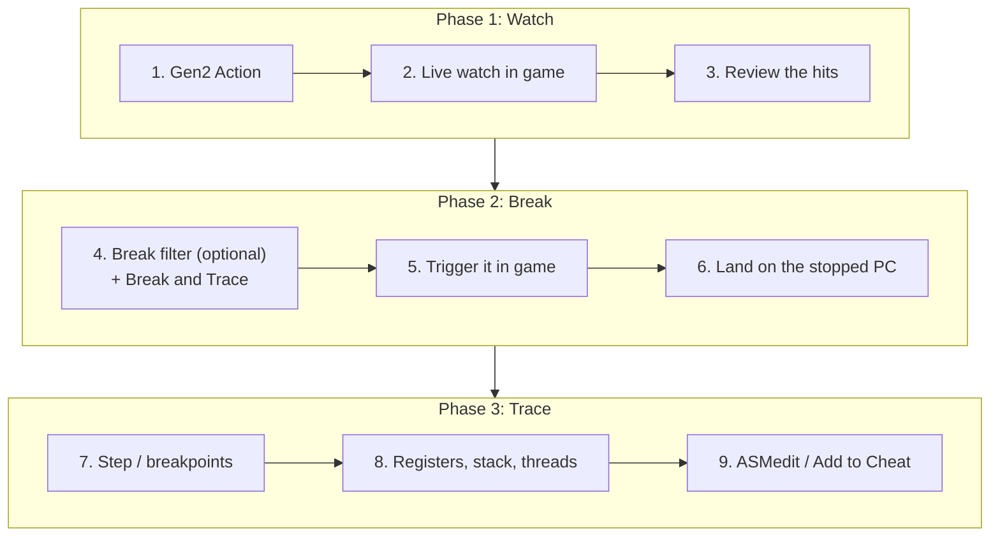
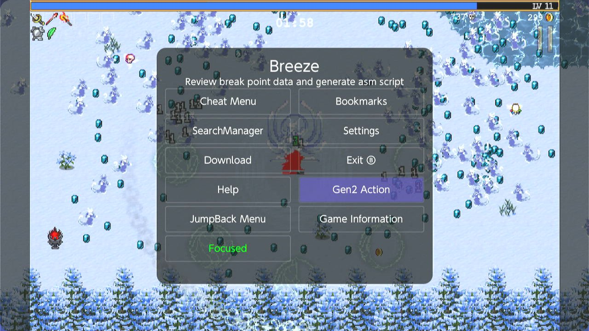
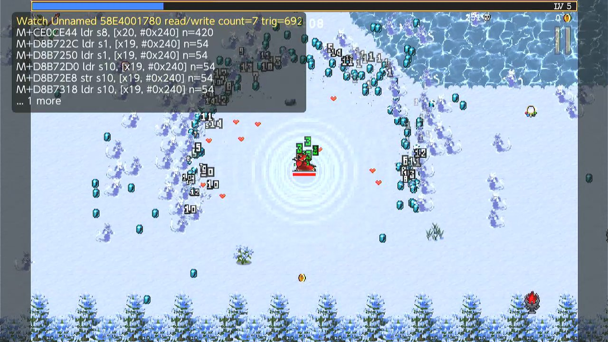
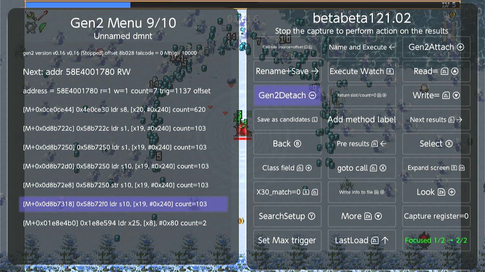
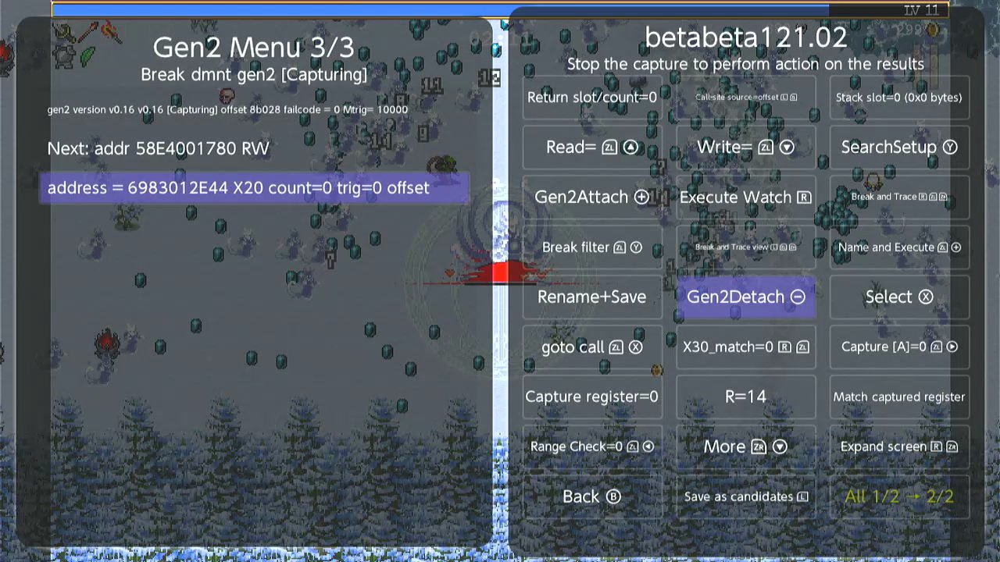
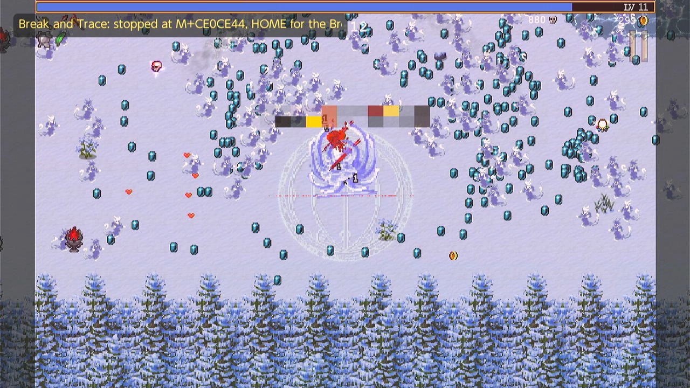
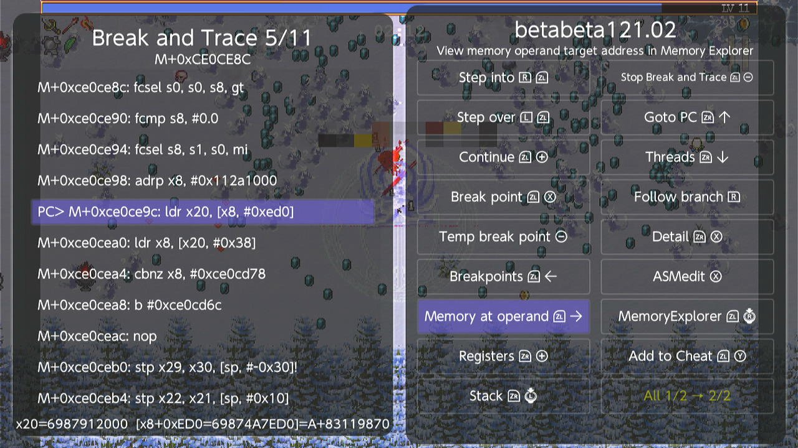
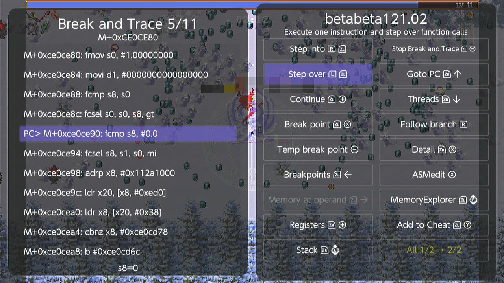
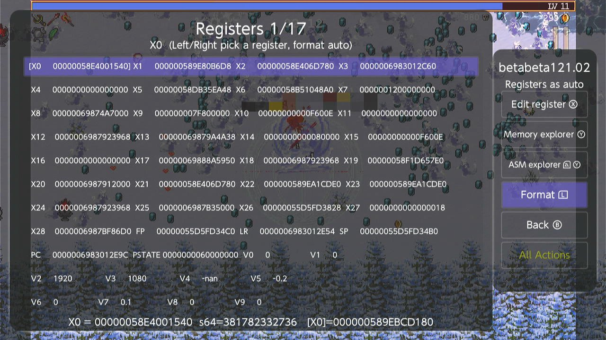
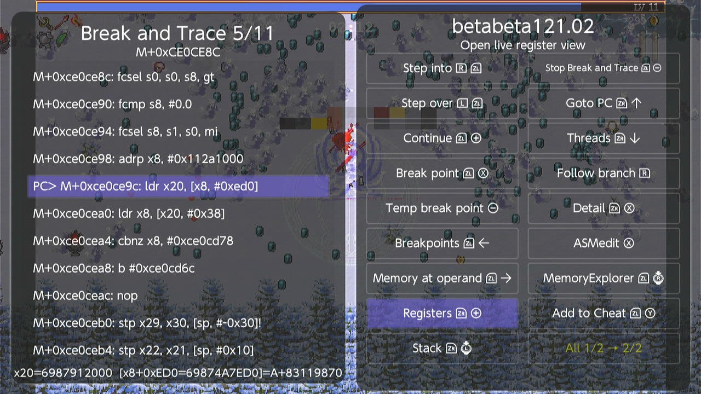

# Breeze Break and Trace: Visual Step-by-Step Tutorial

> [!NOTE]
> Illustrated with screen captures from **Breeze beta121.02** on a Nintendo Switch.
> Every shortcut below was taken from the menu definitions in the source, so it
> matches what the buttons on your screen actually do.

---

## What Break and Trace is

Gen2's **Watch and Capture** mode records the instructions that touch an address
while the game keeps running: you learn *what* touched the value, and how often.

**Break and Trace** stops the game the moment the access happens and hands you a
debugger: the instruction that is about to run, every register, the stack, the
thread list, breakpoints you can set anywhere in the code, and single-stepping.
It is the difference between a list of suspects and being in the room.

The game is genuinely halted, so you can take as long as you like. Nothing is
lost while you look.

### What you need

| | |
|---|---|
| **The gen2 fork** | `atmosphere/contents/010000000000d609`, version **v0.16** or later. Without it there is no **Gen2 Action** button on the main menu at all; with an older one Breeze says *"Please goto settings to install gen2 fork"*. Settings has an Install/Update button for it. |
| **SwitchU fork 1.2.0g** *(optional)* | Interface 3 lets Breeze **show itself over the game by itself** when a breakpoint hits. Without it everything still works — you just press `HOME` yourself when the toast appears. |

### Workflow at a glance



### Notation

`R-Stick ←/→/↑/↓` is the **right stick pushed** in that direction; `R-Stick` on
its own is the right stick **click**. `(+)` and `(-)` are Plus and Minus.
A `+` between buttons means hold them together.

---

## Step 1: Open Gen2 from the Breeze main menu

Open Breeze while your game is running.



* Highlight **Gen2 Action** — shortcut `R-Stick` (click).
* The tooltip reads *"Review break point data and generate asm script"*.
* Press `A` to enter the Gen2 workspace.

> The button is only present when the gen2 fork is installed; that is the first
> thing to check if you cannot find it.

---

## Step 2: Live memory watch

Point the watch at an address (the usual route is a search result, `Select`,
then **Execute Watch** `[R]`) and go back to the game. Gen2 records accesses
without stopping anything:



```text
Watch Unnamed 58E4001780 read/write count=7 trig=692
M+CE0CE44 ldr s8, [x20, #0x240] n=420
M+D8B722C ldr s1, [x19, #0x240] n=54
M+D8B7250 ldr s1, [x19, #0x240] n=54
M+D8B72D0 ldr s10, [x19, #0x240] n=54
M+D8B72E8 str s10, [x19, #0x240] n=54
```

The HUD is drawn over the live game by Breeze itself. `count=` is how many
distinct instructions were captured, `trig=` how many times the address was
touched in total, and `n=` the count for one line.

---

## Step 3: Review the candidates in the Gen2 menu

Press `HOME` to come back to Breeze and look at what was collected:



* **Left panel** — one line per instruction that touched the address: offset
  (`M+0x0ce0ce44`), the disassembled opcode (`ldr s8, [x20, #0x240]`) and its
  count.
* **Right panel** — the action grid: `Execute Watch [R]`, `Read=` `[ZL] + ↑`,
  `Write=` `[ZL] + ↓`, `Break filter`, `Break and Trace`, and the rest.

Pick the line you care about with the cursor before moving on.

---

## Step 4: Arm Break and Trace



| Button | Shortcut | What it does |
|---|:---:|---|
| **Break and Trace** | `[R] + [ZL] + [ZR]` | Arms the watch so a hit **stops the game** instead of being recorded. |
| **Break filter** | `[ZL] + (Y)` | Narrows *which* hit stops the game (below). |
| **Break and Trace view** | `[L] + [ZL] + [ZR]` | Opens the debugger view without arming anything. |

> [!IMPORTANT]
> **Break and Trace** is what arms it. There is no separate "arm" button, and it
> does **not** re-arm the breakpoints in your Breakpoints list — it arms the
> watch only. Use **Continue** from inside the view, or **Start Break and
> Trace** in the Breakpoints view, when you want the list armed.

### The Break filter

Without a filter, *any* access to the address stops the game — including the
background writes that happen every frame. The filter makes the stop conditional
on where the access came from.

Put the cursor **on a captured line** and press **Break filter** `[ZL] + (Y)`:

* If the line only has a call site (x30), the filter is toggled on or off
  straight away.
* If the line also captured stack slots, a small **Break filter** menu opens
  listing the call site and each slot:

  ```text
  Line 3: a hit breaks only when these match
  [x] call site  M+CE0CE44
  [x] stack 1  sp+0x20  M+D8B722C
  [ ] stack 2  sp+0x40  M+A11C008
  ```

  | Button | Shortcut |
  |---|:---:|
  | Toggle the item under the cursor | `(X)` |
  | All | `(Y)` |
  | None | `(-)` |
  | Clear filter | `[ZL] + (-)` |
  | Done | `(B)` |

  Choosing nothing and pressing **Done** clears the filter (the status line
  tells you which of the two will happen).

Pressing **Break filter** when the cursor is **not** on a captured line reopens
the filter that is already set, so you can adjust it after the line it came from
has scrolled away.

When a filter is active the HUD says so: `waiting for read at M+CE0CE44 (filtered)`.

---

## Step 5: The hit

Go back to the game and do the thing — take damage, fire a shot, spend a coin:



```text
Break and Trace: stopped at M+CE0CE44, HOME for the Break and Trace view
```

The game is now halted.

* **With SwitchU fork 1.2.0g**, Breeze brings itself up over the game on its own
  and you land in the view without touching anything.
* **Otherwise**, press `HOME` when you see the toast.

---

## Step 6: The Break and Trace view



This is the ASM Explorer, titled **Break and Trace** while the game is stopped
(it says **ASM Explorer** while the game runs, and the debugger buttons grey
out — that is how you tell at a glance).

* **`PC>`** marks the instruction that is about to execute. The view always
  opens centred on it.
* **Markers** to the right of a line:

  | Marker | Meaning |
  |:---:|---|
  | `*BP` | persistent breakpoint, enabled |
  | `-BP` | persistent breakpoint, disabled |
  | `*bp` | temporary (one-shot) breakpoint, enabled |
  | `-bp` | temporary breakpoint, disabled |
  | `*W` | the watch address |

* **Operand peek** on the line below the panel evaluates the cursor
  instruction's operands against the live registers:

  ```text
  x20=6987912000  [x8+0xED0=69874A7ED0]=A+83119870
  ```

  For `str s0, [x19, #0x468]` it shows `s0` and what `[x19+0x468]` holds *right
  now* — so you can see the value about to be written before it is written.

* When the game is **not** stopped the same line tells you what is armed:
  *"The game is running; watch at M+CE0CE44, 2 breakpoints armed"*.

> Breeze puts back the instruction each of its breakpoints replaced before
> disassembling, so a breakpoint line reads as real code and never as
> `E7FFFFFF`.

---

## Step 7: Stepping, breakpoints and continuing



| Action | Shortcut | Description |
|---|:---:|---|
| **Step into** | `[R] + [ZL]` | One instruction; follows `BL` / `BLR` into the callee. |
| **Step over** | `[L] + [ZL]` | One instruction; runs a call to completion and stops after it. |
| **Continue** | `[ZL] + (+)` | Arms every **enabled** breakpoint, lets the game run, and hides Breeze. |
| **Stop Break and Trace** | `[ZL] + (-)` | Disarms *everything* — watch and all breakpoints — lets the game run, and returns you to the **Gen2 menu**. |
| **Goto PC** | `[ZR] + R-Stick ↑` | Re-centres the listing on the stopped PC. |
| **Break point** | `[ZL] + (X)` | Toggle a persistent breakpoint on the cursor line. |
| **Temp break point** | `(-)` | Toggle a one-shot breakpoint on the cursor line. |
| **Breakpoints** | `[ZL] + R-Stick ←` | The breakpoint list. |
| **Registers** | `[ZR] + (+)` | The register grid. |
| **Stack** | `[ZR] + L-Stick` (click) | The stack at the stop. |
| **Threads** | `[ZR] + R-Stick ↓` | The thread list. |
| **Memory at operand** | `[ZL] + R-Stick →` | Memory Explorer at the address the cursor instruction dereferences. |
| **Memory Explorer** | `[ZL] + R-Stick` (click) | Memory Explorer at the cursor address. |
| **Follow branch** | `[R]` | Jump to the branch target on the cursor line. |
| **ASMedit** | `(X)` | Patch the instruction in memory. |
| **Add to Cheat** | `[ZL] + (Y)` | Turn the patch into an Atmosphere cheat code. |
| **Detail** | `[ZR] + (X)` | Instruction detail dump. |
| **Back** | `(B)` | Leave the view (the game stays stopped). |

The two breakpoint buttons **toggle**, and they also **convert**: pressing
**Break point** on a line that already carries a temp breakpoint turns it into a
persistent one, and vice versa. Pressing the matching button again removes it.

> [!TIP]
> `*bp` (temporary) is the one to reach for when you just want to get past a
> loop: set it a few lines down, **Continue**, and it is gone once it fires.
> `*BP` survives until you delete it or stop Break and Trace.

> [!IMPORTANT]
> **Stop Break and Trace** clears everything and drops you back at the Gen2
> menu. To keep your breakpoints and just let the game run, use **Continue**.

---

## Step 8: Registers, stack and threads

### Registers



Open with `[ZR] + (+)`. A Memory-Explorer-style grid: the D-pad / stick moves
between rows, **left and right move between columns**, and the selected cell is
bracketed `[ ]`.

* `X0`–`X28`, then `FP` (x29), `LR` (x30), `SP`, `PC`, `PSTATE`
* `V0`–`V31`, the SIMD / floating-point registers
* The line below the grid expands the selected register: signed value, what it
  points at (`[X0]=000000589EBCD180`), or `f32`/`f64` for a V register.

| Button | Shortcut |
|---|:---:|
| **Edit register** | `(X)` |
| **Memory explorer** at that value | `(Y)` |
| **ASM explorer** at that value | `[ZL] + (Y)` |
| **Format** — auto / hex / signed / float / double | `[L]` |
| **Back** | `(B)` |

### Stack

`[ZR] + L-Stick` click. Each slot at the stop, what it holds and where it points
— these return addresses are exactly what the Break filter's stack slots match.
`[L]` / `[R]` page, `(X)` opens Memory Explorer, `(Y)` opens ASM Explorer.

### Threads

`[ZR] + R-Stick ↓`. A halted game has no single PC — every thread is stopped
wherever it happened to be. The list shows each thread's name, `pc`, `lr`, `sp`
and id, with `>` on the current one.

Press **Use this thread** `(X)` and that thread becomes the one **Step** and
**Continue** act on. If you step and nothing seems to move, you are very likely
stepping the wrong thread.

### Breakpoints

`[ZL] + R-Stick ←`, from the view — or from the Gen2 menu, to pick up where you
left off.

| Button | Shortcut |
|---|:---:|
| **Enable/disable** | `(X)` |
| **Start Break and Trace** — arms the enabled ones | `(+)` |
| **ASM explorer** at that breakpoint | `(Y)` |
| **Delete** | `(-)` |
| **Delete all** | `[ZL] + (-)` |

A disabled breakpoint keeps its place in the list and still shows in the
disassembly as `-BP` / `-bp`, so you can park one without losing it.

---

## Step 9: From an instruction to a cheat



Once the culprit is identified:

* **Memory at operand** `[ZL] + R-Stick →` — Memory Explorer at the address the
  instruction dereferences, which is usually the structure you are after.
* **ASMedit** `(X)` — patch the instruction in the live game, e.g. a decrement
  replaced by `NOP` (`1F 20 03 D5`). The effect is immediate.
* **Add to Cheat** `[ZL] + (Y)` — turn that patch into an Atmosphere cheat code
  and save it to your cheat list.

---

## Troubleshooting

| Symptom | What it usually is |
|---|---|
| No **Gen2 Action** button on the main menu | The gen2 fork is not installed. Settings → Install/Update. |
| *"Please goto settings to install gen2 fork"* | The installed gen2 is older than v0.16. |
| The game never stops | Nothing armed, or the filter excludes the access you are causing. The HUD line tells you what is armed; clear the filter and try again. |
| It stops constantly | No filter on an address that is touched every frame — set a Break filter on the row you care about. |
| Step or Continue seems to do nothing | You are acting on the wrong thread. Open **Threads** and pick the one whose `pc` is where you expect. |
| You land in a stale view after HOME | Use **Stop Break and Trace**, which returns to the Gen2 menu rather than leaving the view behind. |
| A leftover `E7FFFFFF` in the code | A breakpoint that was recorded wrong. Restart the game — gen2 patches game code, and only a fresh copy is guaranteed clean. |

---

## Summary of shortcuts

### Breeze main menu
| Command | Shortcut |
|---|:---:|
| Gen2 Action | `R-Stick` (click) |

### Gen2 menu
| Command | Shortcut |
|---|:---:|
| Execute Watch | `[R]` |
| Break and Trace (arm) | `[R] + [ZL] + [ZR]` |
| Break filter | `[ZL] + (Y)` |
| Break and Trace view | `[L] + [ZL] + [ZR]` |
| Read= | `[ZL] + ↑` |
| Write= | `[ZL] + ↓` |
| Gen2Attach | `(+)` |
| Gen2Detach | `(-)` |
| Select | `(X)` |

### Break and Trace view
| Command | Shortcut |
|---|:---:|
| Step into | `[R] + [ZL]` |
| Step over | `[L] + [ZL]` |
| Continue | `[ZL] + (+)` |
| Stop Break and Trace | `[ZL] + (-)` |
| Goto PC | `[ZR] + R-Stick ↑` |
| Break point | `[ZL] + (X)` |
| Temp break point | `(-)` |
| Breakpoints | `[ZL] + R-Stick ←` |
| Registers | `[ZR] + (+)` |
| Stack | `[ZR] + L-Stick` (click) |
| Threads | `[ZR] + R-Stick ↓` |
| Memory at operand | `[ZL] + R-Stick →` |
| Memory Explorer | `[ZL] + R-Stick` (click) |
| Follow branch | `[R]` |
| ASMedit | `(X)` |
| Add to Cheat | `[ZL] + (Y)` |
| Detail | `[ZR] + (X)` |
| Back | `(B)` |
