# Make cheat (Memory Explorer)

**Memory Explorer > Make cheat (ZL + D-pad Down)** turns the pointer chain you
are looking at into a cheat. It can write to:

- **one value**: the value at the end of the chain, or
- **every element of an array**: the same value in each enemy, each party
  member, each inventory slot. This is a *loop cheat*.

What it writes is your choice: a fixed value, a fixed value only where the
current one is higher or lower, or a copy of another field (current HP = max HP).

The cheat is added to the cheat list **disabled**. Turn it on in **Cheats**.

Needs Breeze **beta124.02** or later. The screenshots are from The Walking
Dead: Streets of Survival (a Unity game), with 29 enemies on the map.

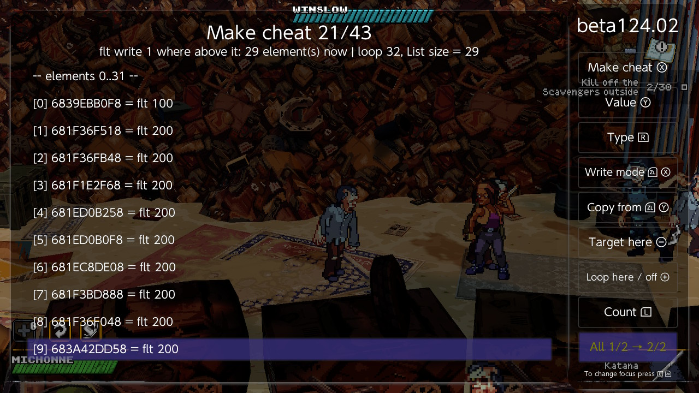

## Before you start

Make cheat needs a **pointer chain that starts in the game's main module**.
Memory Explorer has one when its status line starts with `z=` followed by the
chain:

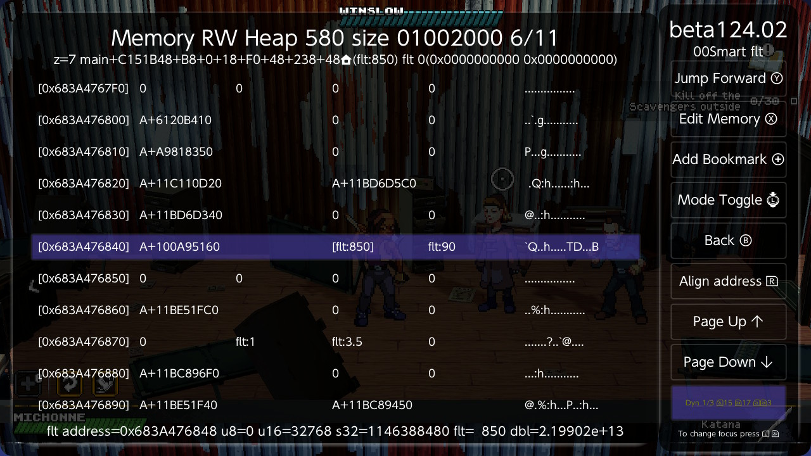

Ways to get there:

- open a pointer bookmark in Memory Explorer,
- open a chain found with *Find chain* (Unity menu, field view),
- from a pointer cheat you already have: **Cheats > Edit Cheat**, put the
  cursor on the cheat's first code line and press **ZL + D-pad Right** (Jump
  to target).

`z` is the chain step the cursor is on. **ZL+B** moves one step back towards
the module, **ZL+Y** one step forward towards the value.

Without a chain the button answers *No pointer chain here*. If the game has
freed the objects since, it answers *The pointer chain no longer resolves*.

## Where the cursor is decides what you get

| Cursor (`z`) on | Make cheat opens as |
|---|---|
| the value itself (the last step) | a cheat for that **one value** |
| an element of an array | a **loop** over the array, writing the value at the end of the chain |

Both can be changed on the screen, so a wrong guess costs one key press.

## One value

With the cursor on the hero's health, Make cheat opens like this:

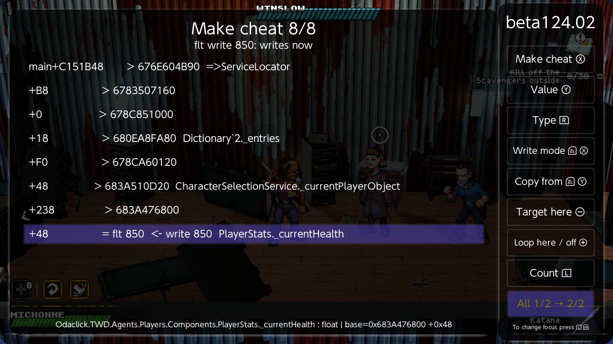

The list shows one row per chain step:

- `> address` is where that step's pointer leads now.
- `= value  <- action` is the target, and what the cheat will do to it.
- A name after a row is the class and field Breeze found for it
  (`PlayerStats._currentHealth`). The line at the bottom gives the full name,
  type and object of the step under the cursor.
- The line under the title sums the cheat up, live: `flt write 850: writes now`.

**Value (Y)** changes the value, **Type (R)** the type, then **Make cheat (X)**
asks for a label and adds the cheat.

## Buttons

| Button | Key | What it does |
|---|---|---|
| Make cheat | X | Asks for a label, then adds the cheat (disabled) |
| Value | Y | The value to write. Starts as the target's current value |
| Type | R | u8 > s8 > u16 > s16 > u32 > s32 > u64 > s64 > flt > dbl. Starts as Memory Explorer's type |
| Write mode | ZL+X | Always > where above > where below > copy |
| Copy from | ZL+Y | Pick the field to copy (see below) |
| Target here | Minus | Make the selected chain step the value to write |
| Loop here / off | Plus | Loop over the array at the selected step. On the loop step again: no loop |
| Count | L | Loop: how many elements it visits |
| Count from | ZL+L | Loop: Fixed, or the array's own count read from the game |
| Stride | ZL+R | Loop: bytes from one element to the next (hex) |
| Back | B | Back to Memory Explorer |

## Write modes

**Write mode (ZL+X)** cycles through four.

| Mode | The cheat writes | Use it for |
|---|---|---|
| Always | the value, every time | A plain freeze: ammo, money, a timer |
| Where above | the value, only where the current one is higher | Enemies: HP drops to 1 once, your hit still kills them |
| Where below | the value, only where the current one is lower | A floor: HP never under 50, but it can still go up |
| Copy | another field's value | Hero: current HP = max HP, whatever the max is |

Notes on *where above* and *where below*:

- A **negative** current value is never "above". Some games leave a dead
  enemy with negative HP; the cheat does not bring it back to life. *Where
  below* does catch a negative value.
- The value you compare against must not be negative.

## Copy from: picking the field to copy

Switching to **Copy** makes a first guess by name: for `_currentHealth` it
looks for a field with the same stem (`_maxHealth`, `Health`) in the same
object and in the objects its neighbouring pointers lead to. Here it found
the hero's base health one object away:

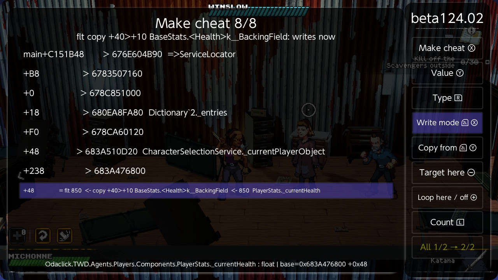

`copy +40>+10 BaseStats.<Health>` reads: the pointer at `+40` of the target's
object, then the field at `+10` of what it points to. `<- 850` is the value
there now.

To choose the field yourself:

1. Put the cursor on the chain step whose object you want to start from. The
   target row is the usual choice: it opens the object that holds the target.
2. Press **Copy from (ZL+Y)**. That object opens in the **field view**.

   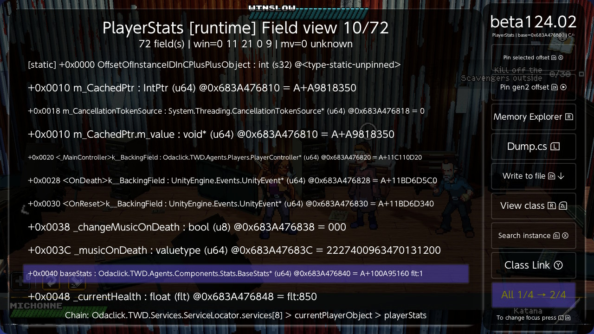

3. Go to the field to copy. To go through a pointer field, select it (here
   `baseStats`) and press **View class (ZL+R)**; repeat for as many objects
   as it takes.
4. On the field, press **Pick source (ZR+Plus)**. This is the field view's
   *Make cheat* button, renamed while a pick is in progress.

   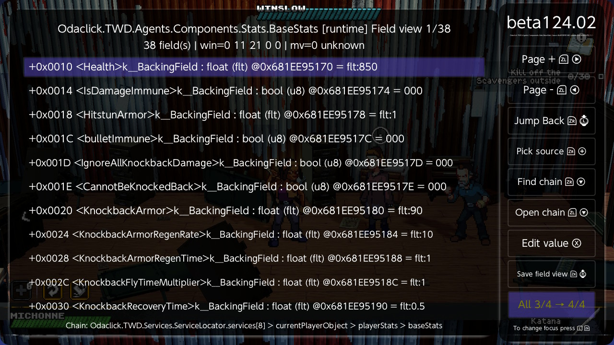

You are back on the Make cheat screen, in Copy mode, with the picked field as
the source. Leaving the field view with B cancels the pick and changes nothing.

**Make cheat (X)** then adds it:

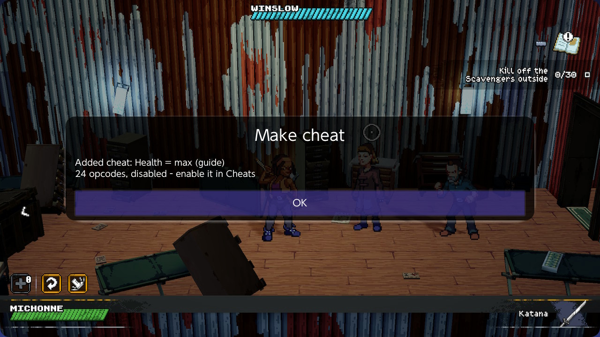

If no field view opens on that object (Breeze has no class information for
it), a keyboard asks for the offset instead, in hex, from the target's object:
`4C` is the field at +4C, `40>10` is the field at +10 of what +40 points to.

## A loop over an array

Here the chain goes through the game's list of enemies. The cursor is on
`z=7`, the step that holds **element 0** of the list's array:

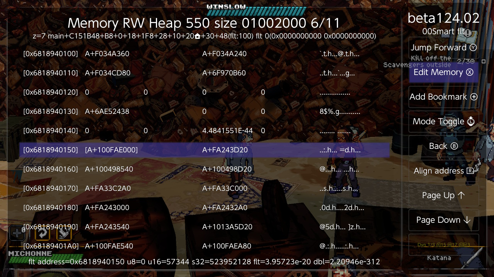

Make cheat sees the array and opens as a loop:

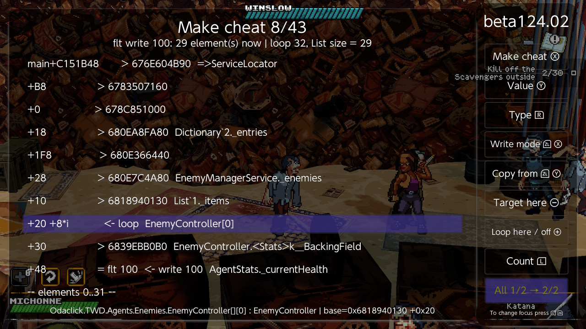

- `+20 +8*i  <- loop` marks the step that walks the array: its offset becomes
  `offset + stride * i`. `EnemyController[0]` is Breeze's name for the element.
- The status line: `29 element(s) now | loop 32, List size = 29`. The cheat
  would write 29 values right now; the loop runs up to 32 times and stops at
  the list's own size, which is 29.

Below the chain, the screen lists every element the loop visits, with its
address and current value. This is the check that the loop is on the right
step: the values should be the ones you expect, here every enemy's HP.


Notes that can follow an element:

- `(left alone)`: the write mode's condition is not met for it now.
- `<- 200`: copy mode, the value that would be copied in.
- `null or unreadable: skipped`: an empty slot. The cheat skips it too.
- `(past the live count: not written)`: a slot beyond what the game uses now.

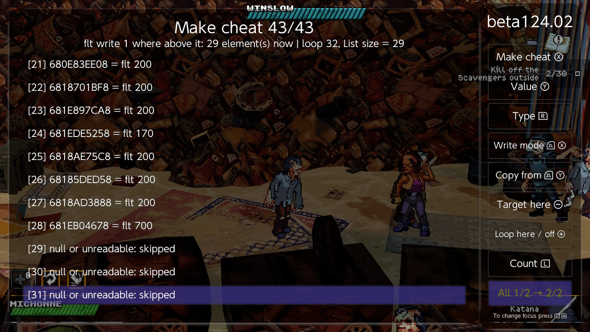

### Choosing the loop step

**Loop here / off (Plus)** on a chain step makes that step the one that walks
the array. The step to choose is the one holding element 0, the first slot
*inside* the array, not the pointer to the array. On a step Breeze recognises
as an array the row says `(array: Loop here)` while the loop is off.

### Where the loop stops

The loop buttons are on the second page of the panel:

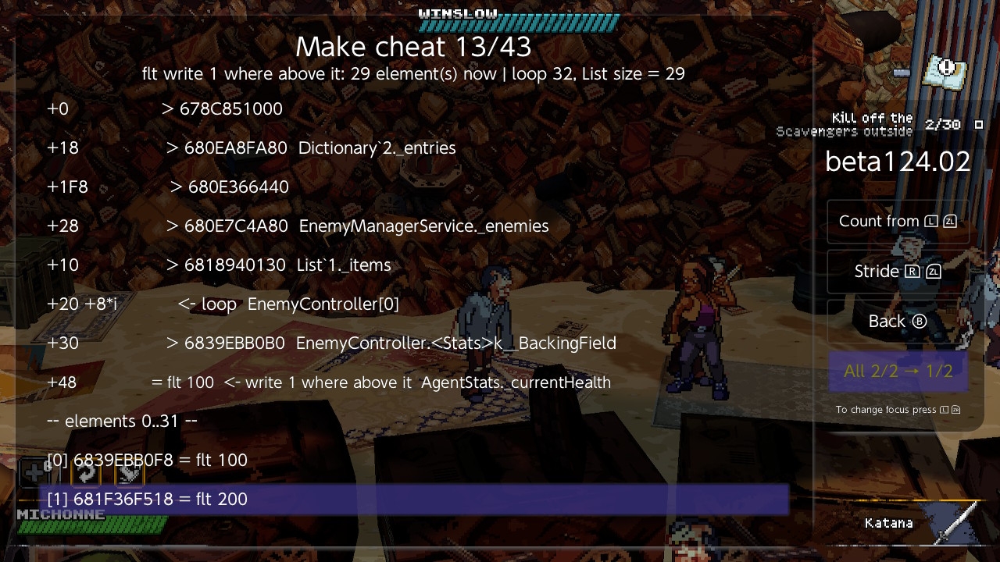

**Count from (ZL+L)** chooses how the loop knows where to stop:

| Count from | Stops at | Found when |
|---|---|---|
| Fixed | the number in *Count* | always available |
| Array length | the array's length, read each time | Unity array |
| List size | the List's item count, read each time | Unity `List<T>` (chosen by default) |
| TArray Num | the array's `Num`, read each time | Unreal `TArray` |

Prefer a live count when one is offered. A List's array is larger than the
list: the slots past the count can still point at objects the game has
finished with, and a fixed count would write to them. With a live count,
**Count (L)** is only a ceiling. It starts rounded up (29 enemies gave 32) to
leave the list room to grow, so the cheat keeps working when more appear.

With **Fixed**, Count starts at the number of elements that resolve now.

**Starting part-way.** The loop starts at the cursor's element. If Memory
Explorer's chain points at element 3 (`+38` rather than `+20`), the cheat does
elements 3 onwards, and the header row says so (`-- elements 3..18 --`).

**Stride (ZL+R)** is 8 for an array of object references, which is the usual
case. An array of structs stored inline needs the struct's size.

**Target here (Minus)** moves the target to an earlier step. Use it when the
value is in the array slot itself (an array of ints): put the cursor on the
loop step and press it.

### Copy in a loop

In Copy mode each element gets its own source, so every enemy is set to its
own base health:

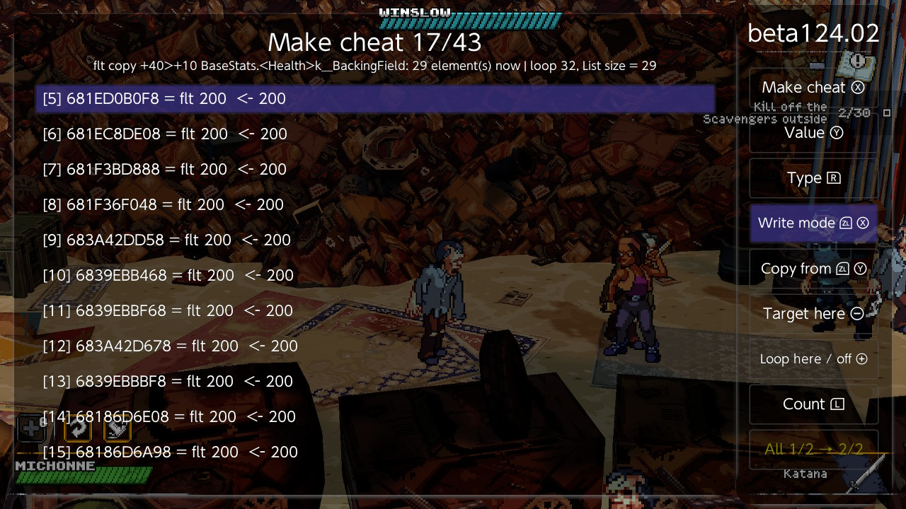

That is the case when the source is in the element or below it. A source
somewhere else (a chain that leaves the target's before the array) is one
value for all, read once; the status line then says `one source for all`.

## Three recipes

**Enemies die in one hit.** Cursor on the array element > Make cheat >
*Value* 1 > *Write mode* until `where above it` > check the element list >
*Make cheat*.

**Hero always at full health.** Cursor on the health value > Make cheat >
*Write mode* until `copy` > check the source on the target row, or choose it
with *Copy from* > *Make cheat*.

**Freeze one value.** Cursor on the value > Make cheat > *Value* > *Make cheat*.

## The cheat it makes

The label offered is built from the field name and the action
(`_currentHealth x32 max 1`, `_currentHealth = Health`); change it as you like.
The new cheat is at the end of the list, off. **Toggle Cheat (X)** turns it on.

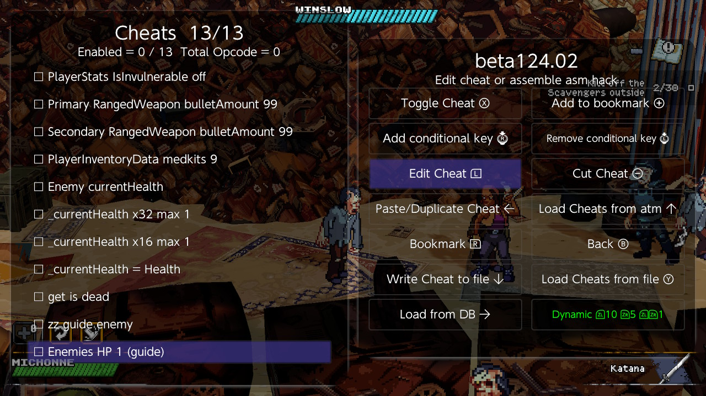

To read it, press **Edit Cheat (L)** and **Toggle Disassembly**:

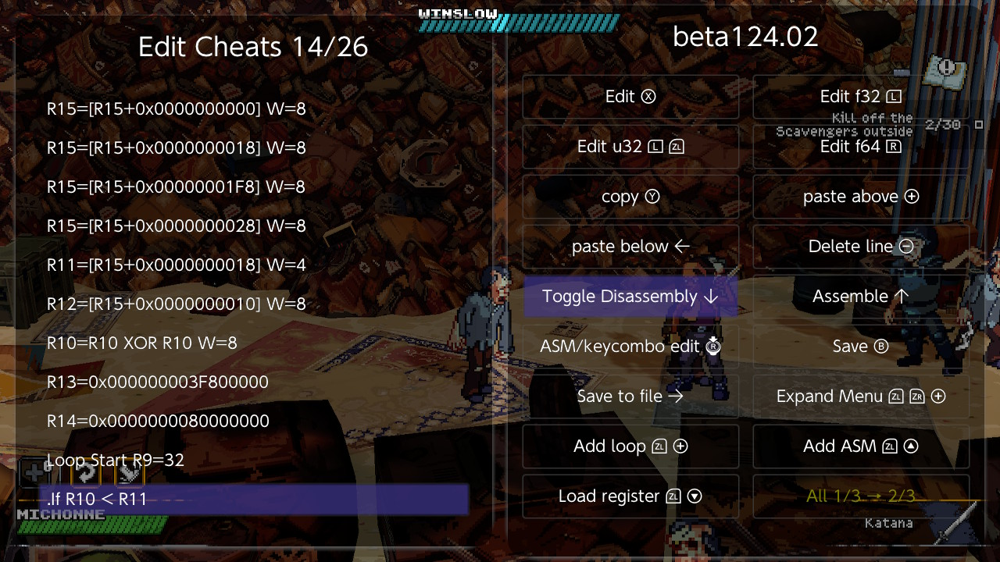

The whole enemy cheat (value 1, where above, List size), 47 opcodes:

```
580F0000 0C151B48            R15=[Main+0xC151B48]
580F1000 000000B8            R15=[R15+0xB8]
580F1000 00000000            R15=[R15+0x0]
580F1000 00000018            R15=[R15+0x18]
580F1000 000001F8            R15=[R15+0x1F8]
580F1000 00000028            R15=[R15+0x28]        the List
540B2F00 00000018            R11=[R15+0x18]        its size
580C2F00 00000010            R12=[R15+0x10]        its array
988AA0A0                     R10=R10 XOR R10       index = 0
400D0000 00000000 3F800000   R13=1.0               the value
400E0000 00000000 80000000   R14=the sign bit
30090000 00000020            Loop Start R9=32
C083A5B0                     .If R10 < R11
580F2C00 00000020            ..R15=[R12+0x20]      the element
580F1000 00000030            ..R15=[R15+0x30]      its stats
780F0000 00000048            ..R15=R15 + 0x48      its health
C043D2F0 00000000            ..If R13 < [R15]      above the value
C041E2F0 00000000            ...If R14 > [R15]     and not negative
640F0000 00000000 3F800000   ....[R15]=1.0
20000000                     ...Endif
20000000                     ..Endif
20000000                     .Endif
780A0000 00000001            .R10=R10 + 1
780C0000 00000008            .R12=R12 + 8          next slot
31090000                     .Loop stop
```

It uses R9 to R15 and leaves them as they are when it ends. A cheat of your
own that runs after it and needs a register at 0 must clear it itself.

## Good to know

- **A cheat is only as lasting as its chain.** In this game the enemy manager
  sits in a dictionary, and its slot (the `+1F8` step) is different from level
  to level. The enemy cheat made in one level does nothing in another; it does
  no harm there, because a chain that breaks writes nothing. Make it again
  from a chain that is valid in the new level, or look for a chain that does
  not pass through that dictionary.
- Cheats run about 12 times a second. *Where above* lowers a new enemy's HP
  within a fraction of a second of it appearing, not before.
- The chain must start in the main module, and its first offset must not be
  negative.
- A value in the module itself, with no pointer before it, can only be written
  with a fixed value (*Always*).
- Copy does not support a negative offset on the target or on the source's
  first or last step.
- Count goes up to 4096. The screen lists the first 64 elements.
- A very long chain with copy and conditions can exceed one cheat's size; the
  screen then says *The cheat does not fit in one cheat's opcodes*.
- Tried on a Unity game. Unreal arrays (TArray Num), *Pick source* in the
  Unreal field view, arrays stored in the module and 32-bit games are written
  but have not been tried on a console yet.
