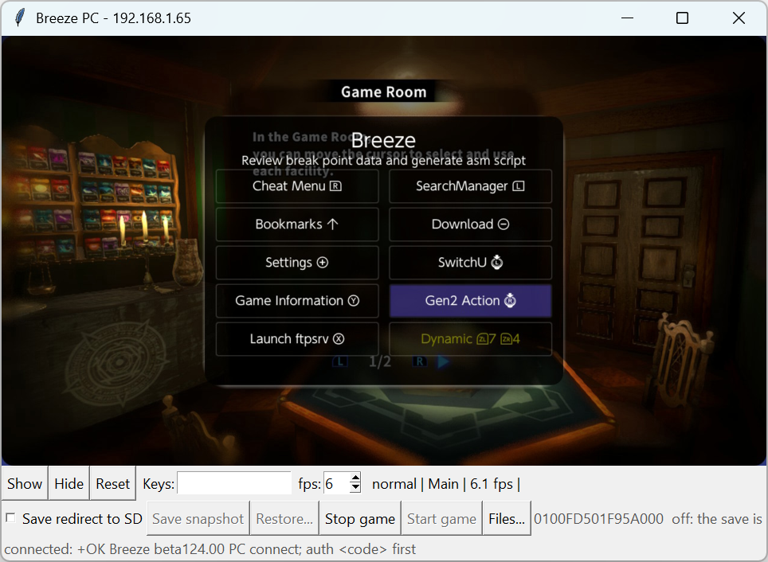
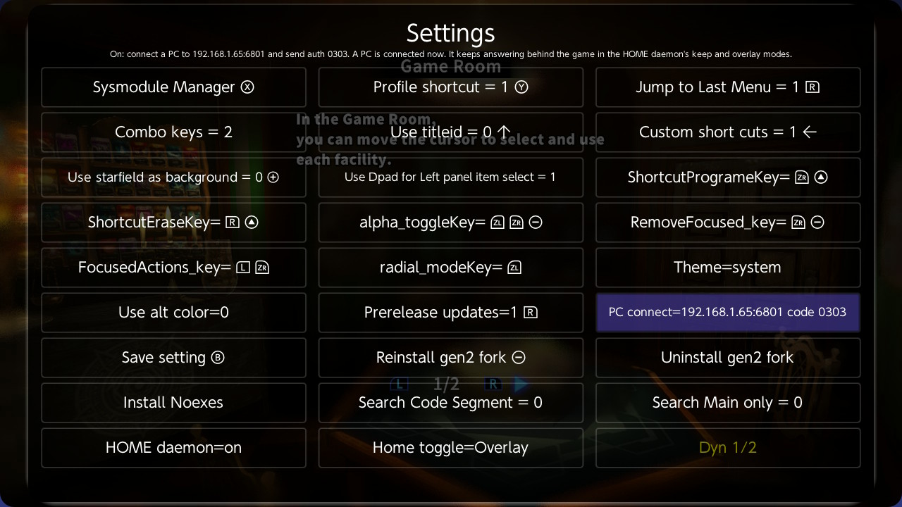
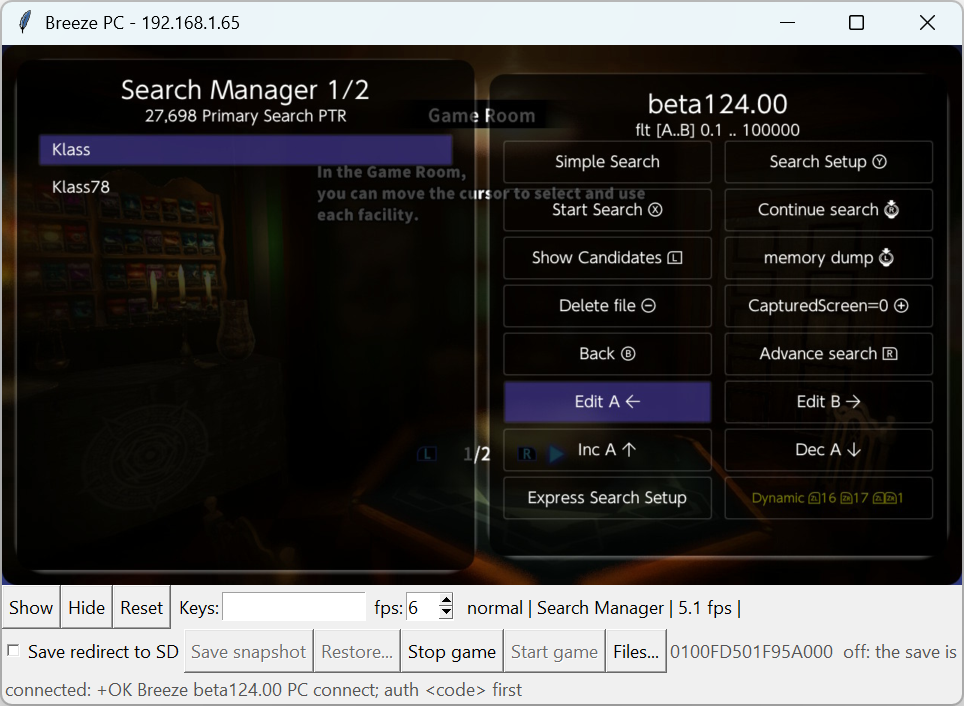
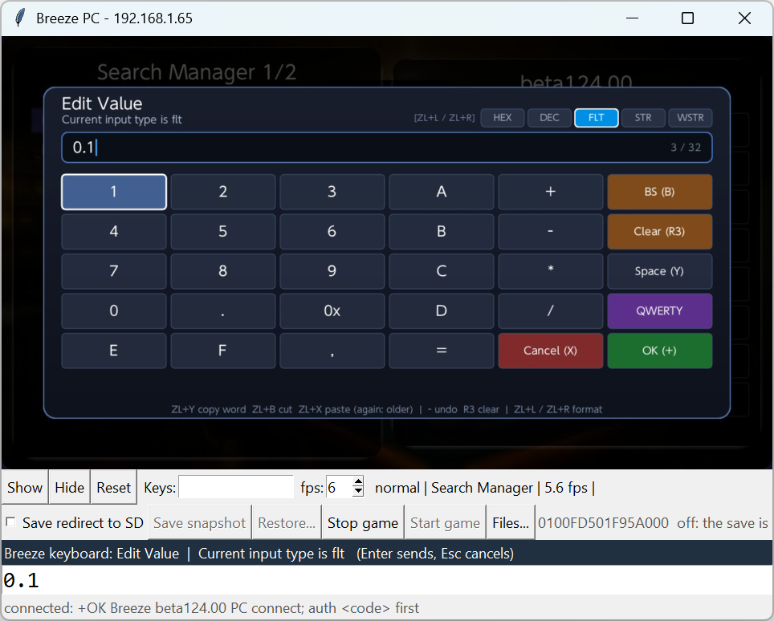
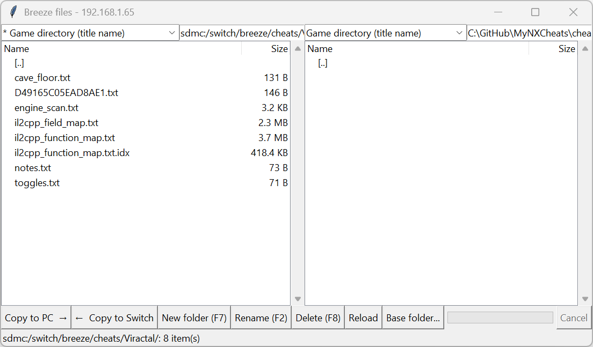

# Breeze PC App Guide

The Breeze PC app shows Breeze's screen in a window on your PC and lets you drive it with the keyboard and mouse over Wi-Fi. It also lets you play the game with the PC's keyboard or a controller plugged into the PC, takes snapshots of a game's save, stops and starts the game, and copies files between the Switch and the PC.



## Overview

The app talks to **PC connect**, a small server inside Breeze (Settings > **PC connect**, TCP port 6801). Nothing else has to be installed on the Switch.

What you can do from the PC:

- **See Breeze's screen**, refreshed a few times a second.
- **Press buttons** with the keyboard, or click Breeze's buttons and rows with the mouse.
- **Type on the PC keyboard** whenever Breeze opens its on-screen keyboard.
- **Play the game** with the PC's keyboard or a Windows controller, and press the Switch's HOME button.
- **Take screenshots** into an album for the game on the PC, and **record** everything the app shows.
- **Snapshot and restore the game's save**, with a picture of the game for each snapshot.
- **Stop and start the game.**
- **Copy files** both ways in a two-panel file manager: cheats, the game's own files, its save, the album, the whole SD card.

PC connect never attaches to the game as a debugger, so the game keeps running while the app is connected.

The app answers only while Breeze is running. With the SwitchU HOME daemon, Breeze keeps running behind the game, so the app stays connected while you play.

## Install

### What you need

- Breeze **beta124.00** or later on the Switch; **beta124.01** or later for Game input and the HOME button.
- The Switch and the PC on the same network.
- **Python 3** on the PC, with Tk. The Windows installer from python.org includes Tk; on Linux install `python3-tk`.
- The **Pillow** package.
- The app's files in one folder: `pcconnect_app.py`, `pcconnect_files.py`, `pcconnect_album.py` and `pcconnect.py`. They are in the root of this repository, and attached to the Breeze release as `pc_app.zip`. `pcconnect_app.bat`, beside them, is optional: on Windows it starts the app with a double click.

### 1. Install Pillow

```
python -m pip install pillow
```

Without it the app stops at once with `ModuleNotFoundError: No module named 'PIL'`.

### 2. Turn on PC connect in Breeze

Open **Settings** from Breeze's main menu and press **PC connect**. When it is on, the button shows the address and the code to use:



Here the address is `192.168.1.65` and the code is `0303`. The line at the top of the screen says whether a PC is connected.

The code is generated once and kept. Leave Settings with **Save setting** and PC connect stays on the next time Breeze starts.

### 3. Start the app

From the folder that holds the files:

```
python pcconnect_app.py 192.168.1.65 0303
```

Use the address and code your own Switch shows. They are remembered in `.breeze_pc.json` in your home folder, so next time this is enough:

```
python pcconnect_app.py
```

Started with nothing remembered and nothing on the command line, the app asks for the address and the code.

On Windows, double-clicking `pcconnect_app.bat` does the same as the second command, with no console window.

When the bottom line of the window reads `connected: ...` and Breeze's screen appears, the app is ready.

## The main window

From top to bottom:

| Part | What it is |
|---|---|
| Screen | Breeze's screen. It refreshes only while the app window has the focus. |
| First row | **Show**, **Hide**, **Reset**, the **Keys** box, the **fps** setting and the status text. |
| Second row | **Save redirect to SD**, **Save snapshot**, **Restore...**, **Stop game**, **Start game**, **Files...** and the save status. |
| Third row | **Game input**, **Player**, **A/B by label**, **HOME**, **Screenshot**, **Album**, **Record** and the game input status. |
| Text box | Appears only while Breeze's keyboard is open. |
| Bottom line | The connection status, or the list of keys. |

The status text in the first row reads, for example, `normal | Main | 5.2 fps |`:

- the overlay state: `normal` (Breeze is full screen), `shown` or `hidden` (HOME daemon overlay mode);
- the title of the menu Breeze is on;
- the refresh rate the app is getting;
- the last error Breeze returned, if any. It clears on the next command that succeeds.

**fps** sets how often the screen is asked for, from 1 to 15 (default 6). Each picture is a JPEG of about 200 KB, and the Switch delivers about 7 a second at most.

The window can be resized; the screen keeps its 16:9 shape.

## Driving Breeze

### Keyboard

Click the screen first so that the keys go to Breeze and not to a text box.

| PC key | Switch button |
|---|---|
| Arrow keys | D-pad |
| Enter, `A` | A |
| Esc, Backspace, `B` | B |
| `X`, `Y` | X, Y |
| `L`, `R` | L, R |
| `Q`, `E` | ZL, ZR |
| `+` (or `=`), `-` | PLUS, MINUS |
| `I`, `K`, `J`, `O` | Right stick up, down, left, right |
| `S`, `T` | Left stick press, right stick press |
| Page Up, Page Down | Move the list cursor 10 rows |
| Home, End | First row, last row |

**Ctrl** adds ZL and **Shift** adds ZR to any of these. Shift+Down is ZR+DOWN; Ctrl+Shift+Y is ZL+ZR+Y.

For any other combination, type it in the **Keys** box and press Enter, for example `L+ZR` or `ZL+PLUS`. Names are joined with `+` and are not case sensitive.

### Mouse



- **Click a button** to press it.
- **Click a row** to move the cursor to it.
- **Double-click a row** to move to it and press A.
- **Mouse wheel** sends D-pad up and down.
- A click anywhere else is a touch on the Switch's screen at that point.

### Typing into Breeze's keyboard

When Breeze opens its keyboard, a text box opens at the bottom of the app with the keyboard's title and the text it already holds:



- Type or paste the text, then press **Enter** to send it. Breeze takes it as if it had been typed on the Switch and closes the keyboard.
- Press **Esc** to cancel. The value is left as it was.
- Read the title line: it names the input type. A decimal keyboard reads digits as decimal, a hex one as hex.
- The keys of Breeze's keyboard can also be clicked with the mouse, which is how you change the format (HEX, DEC, FLT, STR, WSTR).

While the keyboard is open the key mapping above is off, so letters go into the text box.

### Show, Hide and Reset

- **Show** and **Hide** bring Breeze over the game and put it away again. They apply to the HOME daemon's overlay mode. With Breeze full screen there is no overlay to hide, and Breeze answers with an error that appears in the status text.
- While Breeze is hidden the screen in the app is the game, and button presses are refused. Press **Show** first, or tick **Game input** to send them to the game instead.
- **Reset** restarts Breeze from whatever screen it is on, after asking. Use it when a menu cannot be left with buttons. The game and its cheats are not touched, and the app reconnects by itself a few seconds later.

## Playing the game from the PC

The third row sends the PC's keyboard and a controller plugged into the PC to the game. Breeze attaches a **virtual controller** to the Switch for it; the game sees one more controller, and nothing in the game is changed.

**Game input** | **Player** | **A/B by label** | **HOME**

### Before you start

- Breeze has to keep running while the game is on screen. That needs the HOME daemon with the Home toggle on **Keep** or **Overlay**.
- The virtual controller presses whatever is in front on the Switch. While Breeze is on screen that is Breeze's menus. Press **Hide** (or **HOME**) so that the game is in front.

### Turning it on

1. Start the game and put it in front.
2. Tick **Game input**.
3. The text at the right of the row shows what is connected, for example `game input: player 1, controller 1`, or `no controller (keyboard only)`.

Untick the box when you are done. That removes the virtual controller from the Switch.

### With a controller

Any controller that Windows games see as an Xbox controller (XInput) works. Nothing has to be installed for it, and it is read whether or not the app's window is the one in front.

| Controller | Switch |
|---|---|
| Sticks, D-pad | the same |
| LB, RB | L, R |
| Left trigger, right trigger | ZL, ZR |
| Back, Start | MINUS, PLUS |
| Stick clicks | left stick press, right stick press |
| Guide | HOME |
| The four face buttons | by position: the bottom button is the Switch's B, the right one A, the left one Y, the top one X |

Tick **A/B by label** to have the button marked A be A, B be B, X be X and Y be Y instead.

A controller that Windows games do not see as an Xbox controller, such as a PlayStation or Switch controller plugged straight into the PC, is not picked up. Steam and similar tools can make it look like one.

### With the keyboard

Click the screen in the app first. A key stays down for as long as you hold it.

| PC key | Switch |
|---|---|
| `W`, `A`, `S`, `D` | Left stick |
| `I`, `J`, `K`, `O` | Right stick up, left, down, right |
| Arrow keys | D-pad |
| Enter, Space | A |
| Esc, Backspace, `B` | B |
| `X`, `Y` | X, Y |
| `L`, `R` | L, R |
| `Q`, `E` | ZL, ZR |
| `+` (or `=`), `-` | PLUS, MINUS |
| `Z`, `C` (or `T`) | Left stick press, right stick press |
| `H` | HOME |

This is a different table from the one for driving Breeze: `A` and `S` are part of the left stick here, and Ctrl and Shift add nothing. Page Up, Page Down, Home and End do nothing while the box is ticked.

With Breeze hidden, a mouse click on the screen is a touch on the game's screen at that point.

### Player

**Player** is the controller slot the virtual controller takes, 1 by default.

- A game for one player listens to player 1 only. So the PC takes player 1, **and the controller you hold becomes player 2 and stops working in the game** until you untick **Game input**, which gives it back its slot.
- For a game for two, set **Player** to 2: your own controller stays player 1 and the PC plays the second one.

### HOME

**HOME** presses the Switch's HOME button, whether the box is ticked or not. With a game running and the HOME daemon installed, it sends a full-screen Breeze behind the game, or brings it back. It is the way to get back to the game after **Reset**, which leaves Breeze full screen.

### Good to know

- The screen in the app is a few pictures a second. It is there to see where you are; to play, watch the Switch or the TV.
- Game input uses a connection of its own, so a press does not wait behind a picture. With the file manager open as well, the app holds all three of PC connect's connections, and no other program can connect.
- If the connection is lost while a button is down, Breeze lets go of everything by itself.
- After the Switch has slept, the virtual controller is attached again by the next press, and the app takes the chosen player slot again within two seconds.

Touching the game's screen with the mouse, and coming back after sleep, have not been tried yet.

## Screenshots, the album and recording

**Screenshot**, **Album** and **Record** are on the third row. All three keep their pictures in the game's folder on the PC. That is the folder the file manager offers as *Game directory (title name)*: named after the game, under the base folder picked there, or `Breeze games` in your home folder until you pick one.

### Screenshot

Press **Screenshot**, or **F12**. The picture on the Switch's screen is saved as a 1280x720 JPEG named after the date and time, in `album` inside the game's folder. The bottom line of the window shows where it went.

The picture is what is on the Switch's screen at that moment: the game while Breeze is hidden, Breeze over the game while it is shown.

### Album

**Album** opens the game's `album` folder as a window of small pictures, newest first.

- **Click** selects a picture. **Ctrl+click** adds or removes one, **Shift+click** selects a range.
- **Double-click**, Enter or **Open** opens it in the program Windows uses for pictures.
- **Drag** the selection out of the window to copy it somewhere else: an Explorer folder, a chat, a document. Windows only.
- **Delete** removes the selection, after asking.
- **Open folder** shows the folder in Explorer. **Reload** (F5) reads it again.

The window follows a change of game, and a new screenshot appears in it at once. Any picture you put in the folder yourself shows up too.

### Record

Tick **Record** to keep every picture the app receives; untick it to stop. The status text in the first row counts the pictures (`REC 42`).

A recording is a folder, `record/<date_time>/` inside the game's folder, holding:

- the pictures, each named by the number of milliseconds since the box was ticked (`0001380.jpg`);
- `log.txt`, which lists on the same clock every picture, every command the app sent, every controller state sent by Game input, and every change of Breeze's screen.

Recording goes on while the app's window is not in front. It is a few pictures a second -- about 5 at the default **fps** setting, 7 at most -- not a video: it is meant for going through a session afterwards, by you or by a script, to find the moment something happened.

Dragging pictures out of the album has not been tried with a real mouse yet.

## Saves

The second row works on the save of the running game. The app remembers the last game, so **Restore...** and **Start game** also work with no game running. The text at the right of the row shows the game's title id and where things stand.

### Where the save is

A Switch game normally keeps its save inside the console, where it is locked while the game runs. Atmosphere can keep it as plain files on the SD card instead, where it can be copied at any time. **Save redirect to SD** turns that on or off for the running game.

| | Box unticked | Box ticked |
|---|---|---|
| The save is | inside the console | on the SD card |
| Save snapshot works | only while the game is closed | while the game runs |
| Restore writes to | the console | the SD card |

### Turning Save redirect on

1. Tick **Save redirect to SD** and confirm.
2. The app lists what has to happen next. Follow it in order:
   - reboot the Switch, the first time only;
   - start the game again, so that its save is copied to the SD card;
   - **let the game save once before you close it.** Until it has, the copy on the SD card is not complete, and closing the game would leave it with an empty save.
3. The status text follows along: `on: reboot the Switch to start it`, `on: restart the game to move its save to the SD card`, `on: waiting for the game to save`, and finally `on, N snapshot(s)`.

The save inside the console is left as it is. Unticking the box sends the game back to it the next time it starts. Progress made in between stays on the SD card and is not copied back by itself; Restore can carry it over, as described below.

### Taking a snapshot

Press **Save snapshot**. The save is copied as the game last wrote it, together with a picture of the game at that moment. The snapshot is named after the date and time, and the status text reports the number of files and the size.

The button is greyed out when a snapshot cannot be taken: the box is unticked and the game is running, or the box is ticked and the game has not saved yet.

### Restoring a snapshot

The game has to be closed, because a running game would overwrite the restored save. The whole round trip can be done from the PC:

1. **Stop game.**
2. **Restore...** opens a list of the snapshots, newest first. Pick one to see its picture, file count and size.
3. Press **Restore** and confirm. The save that is there now is kept first, as a snapshot named `before_restore_...`.
4. **Start game.**

The line above the list says where Restore writes: the SD card while the box is ticked, the console while it is not.

When the other place also holds a save, it is the first line of the list: `<the save inside the console (NAND)>` or `<the save on the SD card>`. Restoring that line copies the save across, which is how a save is carried from the console to the SD card or back.

**Delete** removes the picked snapshot.

## Stop game and Start game

- **Stop game** ends the running game at once, after asking. It is the same as a crash for the game: anything it has not saved is lost.
- **Start game** starts the last game again. Breeze closes to let the game start, so the app loses its connection and reconnects when Breeze is back. If Breeze does not come back by itself, press HOME on the Switch.

## The file manager

**Files...** opens a second window with the Switch on the left and this PC on the right.



It uses a connection of its own, so a long copy does not freeze the screen in the main window.

### The Switch side

The list above the left panel offers places that belong to the running game. Which ones appear depends on the game and on what exists:

| Place | What it holds |
|---|---|
| Game directory (title name / title id) | Breeze's folder for the game: cheats, notes, bookmarks, maps. A `*` marks the one in use. |
| Atmosphere's game directory | The cheats and patches Atmosphere loads for the game. Listed when it exists. |
| Game files (RomFS, read-only) | The game's own files. |
| Game save (SD card) | The save itself. Listed once Save redirect has moved it to the SD card. |
| Save snapshots | The snapshots taken for the game. Listed once there is one. |
| Today's Album, Album | Screenshots and videos. Today's Album is listed when something was captured today. |
| Breeze | `sdmc:/switch/Breeze/`. |
| SD card | The whole card. |

The list is read again whenever the window gets the focus back, so it follows a change of game. A path can also be typed into the box beside the list.

**The game's own files** can only be copied out. The first time for a game, Breeze has to be allowed to read them: the app asks, adds the game, and then Breeze has to be reopened once by pressing HOME twice on the Switch. After that, pick the place again.

### The PC side

The list above the right panel opens a folder for the running game on the PC:

- **Game directory (title name)**, the default, a folder named after the game;
- **Game directory (title id)**, a folder named after its title id.

Both are made under a base folder when they do not exist. Pick the base folder with **Base folder...**; until you do, it is `Breeze games` in your home folder. The choice is remembered.

With a game running, the PC side starts in the game's folder and follows a change of game, unless you have browsed somewhere else. Going up from the top of a drive lists the drive letters.

### Keys and buttons

The keys act on the panel that has the focus. Selecting in one panel clears the selection in the other, so it is always clear what a key will act on.

| Key | Button | Action |
|---|---|---|
| Enter, double-click | | Open a folder |
| Backspace | | Go up one folder |
| Tab | | Change panel |
| F5 | Copy to PC / Copy to Switch | Copy the selection to the other panel, folders included |
| F7 | New folder | Make a folder |
| F2 | Rename | Rename the selected item |
| F8, Delete | Delete | Delete the selection, after asking |
| Ctrl+R | Reload | Read both panels again |

Several items can be selected with Ctrl and Shift. Before a copy that would overwrite files, the app lists them and asks. The progress bar shows the file being copied, and **Cancel** stops the copy; a file that was only partly copied to the PC is removed.

Copying runs at about 3 MB/s in either direction.

## Troubleshooting

| What you see | What it means |
|---|---|
| `ModuleNotFoundError: No module named 'PIL'` | Pillow is not installed for the Python you started. Run `python -m pip install pillow`. |
| `ModuleNotFoundError: No module named 'pcconnect'` (or `pcconnect_album`, `pcconnect_files`) | The app's files are not all in the same folder. |
| `disconnected: ... (retrying)` | Breeze is not running, PC connect is off, or the address is wrong. The app tries again every 3 seconds. |
| `disconnected: ... wrong code ...` | The code does not match the one Settings > PC connect shows. Start the app with the right address and code on the command line. |
| The connection closes at once | Three programs are already connected. Close one. |
| The screen stops refreshing | The app window lost the focus. Click it. |
| Keys do nothing | The cursor is in the Keys box or a text box. Click the screen. |
| `-ERR busy` in the status text | Breeze is in the middle of a long job. Wait; do not repeat the key. |
| A button press is refused | Breeze is hidden behind the game. Press **Show**. |
| Game input is ticked and the game does not react | Breeze is on screen, so the presses go to Breeze: press **Hide**. Or **Player** is not 1 in a game for one player. |
| My own controller stopped working in the game | **Game input** is ticked with **Player** 1. Untick it. |
| `no controller (keyboard only)` | Windows does not see an Xbox-style controller. Check it works in a Windows game. |
| `game input: ... unknown command` | Breeze on the Switch is older than beta124.01. |

## Security

Anyone on your network who knows the code can drive Breeze, read and write the game's memory and reach the files on the SD card. PC connect is off until you turn it on and stops when Breeze closes. To change the code, edit `code=` under `[PC connect]` in `/switch/Breeze/config.ini`.
